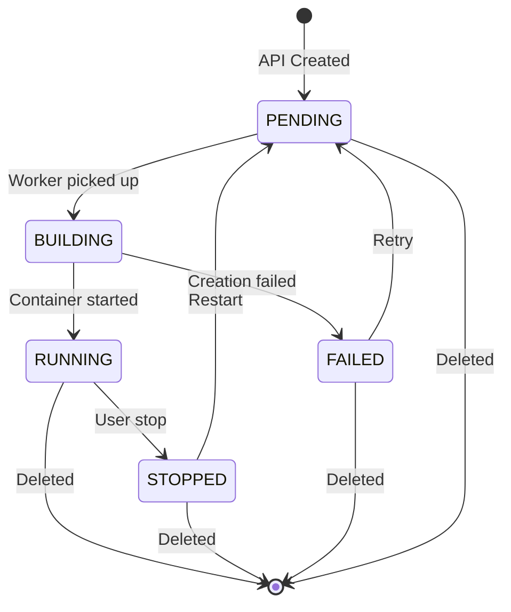

# API Sandbox v1.4 Architecture

This document describes the design, lifecycle, and trust boundaries of the API Sandbox as of `v1.4`.

## What It Is

A fast, self-hosted cloud development environment with significantly stronger isolation than plain Docker. It is designed for small teams and security-conscious users who want Codespaces-like speed without giving up control.

The system uses a strict **Control Plane vs. Data Plane** isolation:
- An **unprivileged Go API (Control Plane)** handles HTTP traffic, OAuth, and orchestration states.
- A **privileged Go Worker (Data Plane)** runs as a background daemon, interfaces with containerd and gVisor, and provisions the environments.

This separation prevents API vulnerabilities from accessing the container runtime and resolves startup loops caused by missing OAuth credentials in the worker environment.

## System Diagram

```mermaid
graph TD
    Client[Web Client]
    
    subgraph Control Plane (Unprivileged)
        Traefik[Traefik Proxy]
        API[Go API - cmd/api]
        PostgreSQL[(PostgreSQL)]
        Redis[(Redis)]
    end
    
    subgraph Data Plane (Privileged)
        Worker[Go Worker - cmd/worker]
    end

    subgraph Org A Network
        EnvA[gVisor Sandbox A]
    end

    Client -->|HTTP / WSS| Traefik
    Traefik -->|/api/*| API
    Traefik -->|Host: envId.domain| EnvA

    API --> PostgreSQL
    API --> Redis
    API -.->|Writes PENDING state| PostgreSQL
    
    Worker -.->|Polls PENDING state| PostgreSQL
    Worker -->|containerd / runsc| EnvA
```

## Environment Lifecycle



## Trust Boundaries

| Boundary | Mechanism | What it protects against |
|----------|-----------|--------------------------|
| API auth | JWT + Cookies | Unauthorized platform access |
| Control Plane | Unprivileged | RCE in the API cannot access container runtimes |
| Tenant network | CNI per org | Inter-tenant network sniffing |
| Container | **gVisor (runsc)** | Kernel exploits, direct host filesystem access |
